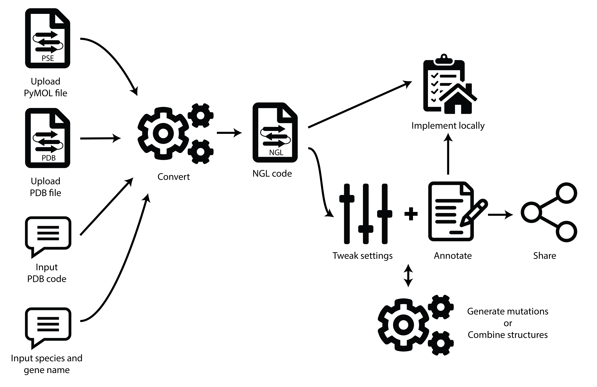

# Michelaɴɢʟo
Michelaɴɢʟo is a web app to convert a PyMOL PSE file or PDB file to a easy to implement NGL.js view that can be implemented easily on any site.

[Click here to visit the web app](https://michelanglo.sgc.ox.ac.uk).

The documentation present here is purely technical for those who want to steal a part of the site or want to implement it locally.
For the documentation for the web app see [help page](https://michelanglo.sgc.ox.ac.uk/docs).

## Aim of Michelaɴɢʟo

The aim of this app is to provide a way for a user to easily generate a web-ready output that can be pasted into a webpage editor resulting in an iteractive protein view.

Therefore the intended audience are biochemists that may not have any web knowledge that wish to display on their academic pages their researched protein.

A future possibility is that in collaboration with specific journals this could be rolled out in papers.

## Deployment

Want to install this webserver locally? Then check out [deployment notes](git_docs/deploy.md).

## Transpiler
The transpiler script does the conversion the PyMol files and a few extras.
The conversion file, `michelanglo/transpiler.py` and the files in `michelanglo/transpiler_templates` are all that is required to use locally.
They are in `michelanglo_app` to avoid allowing the app to do a relative import beyond the top-level package (`michelanglo_app`).

For notes about the details about the conversion see [conversion.md](git_docs/conversion.md)
For notes about the transpiler see [transpiler.md](git_docs/transpiler.md).

## Michelanglo.js
The js that allows web content creators to control NGL without using JS is `michelanglo_app/static/michelanglo.js`, while its documentation is at [michelanglo.sgc.ox.ac.uk/docs/markup](michelanglo.sgc.ox.ac.uk/docs/markup).

* [This is the michelanglo.js from GitHub](michelanglo_app/static/michelanglo.js)
* [This is the michelanglo.js from SGC server](michelanglo.sgc.ox.ac.uk/michelanglo.js)

## Data
For details about how the data stored see also [data](git_docs/data.md).

## Image

Whereas, the most commonly used protein viewing software is PyMol, most researchers render a view and label/draw upon it in Paint/Powerpoint/Photoshop.

Consequently, the code allows users to generate code than when a given static image is clicked it results in a NGL viewer div. Example: [demo](https://michelanglo.sgc.ox.ac.uk/LZTR1.html).

The mouse image can be found [here](git_docs/images/clickmap.jpg).

## data-toggle='protein'
Extra functionality can be optionally added, including the ability to create links that control the protein.

The full documentation and examples can be found at [michelanglo.sgc.ox.ac.uk/docs/markup](https://michelanglo.sgc.ox.ac.uk/docs/markup).

Briefly, `<a href='#viewport'>you see this text as a link</a>` is technically called an anchor element and is commonly called a link.
Like all HTML elements, everything with the within the lesser-than and greater-than symbols controls its behaviour.
The `href` attribute () tells the browser where to point, either to another page or to an element within the page &mdash;the hash symbol means the elements `id` attribute, its unique name.
Following JQuery and Bootstrap behaviour, if a `data-toggle='protein'` is added the code will know to change the protein depending on the other tags.
If a `data-residue='23'` is added a residue index and it's neighourhood is focused on (for chains, use a synthax like `23:A`), for a region use `data-region='23-45'`.
Optionally, `data-title` controls the text that appears in the viewer, while `data-color` (US spelling) controls the colour of the selection.
The default values for the latter are green for regions and hotpink for residues &mdash;See [here for HTML colour names](https://htmlcolorcodes.com/color-names/), for a specific PyMOL colour RGB value, follow the commands in [this PyMOL Wiki page](https://pymolwiki.org/index.php/Get_Color_Indices) and then [convert it to a hex code](https://htmlcolorcodes.com/color-picker/).

## Issues
If it does not work on your site, it may because some information is lost when you added it.

Try adding to your page:

    I am definitely in the correct HTML editor mode as this is <b>enboldened</b> and this is blue.

And view it.

* If the emboldened text is not bold, but has `&gt;b&lt;` before it, you were ending your html page in an editor that showed you the end formatting (WYSIWYG) not the raw HTML code.
* If the emboldened text was bold, but the ought-to-be blue text was not, they the editor may be stripping JS for security reasons or you switched from raw to WYSIWYG before saving and it stripped it.
* If both displayed as hoped then it is trickier.

On Chrome show the console. To do so press the menu button at the top right next to the your face, then `More tools...` then `Developer tools`.
Here you can see what went wrong with your page. Is there a resource not found error? If so, you may have set it to fetch something that was not there or in that location.

If you thing, the fault is in the code please email me.

If the demo image gives you an unsolicited black, that means something went wrong with the parsing of the parts. See the `else {return 0x000000} //black as the darkest error!` line? That is there as a last ditch.
To debug this yourself, open the console and type `protein.structure.eachAtom(function(atom) {console.log(atom.chainid);});` or `atom.resno` or other property of `atom` until you figure out what is wrong with your structure.
I am aware of two unfixed bugs, one is the CD2 atom in histidine residues with different colored carbons and the other is the absence of shades of gray (_e.g._ `gray40`) in the color chart.

## Licence
* [PyMOL](https://github.com/schrodinger/pymol-open-source/blob/master/LICENSE) is a trademark of Schrodinger, LLC, and can be used freely.
* NGL uses an MIT licence.
